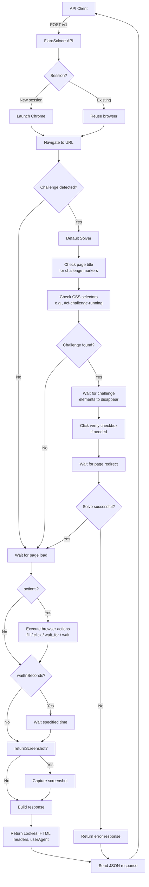

# FlareSolverr API Documentation

## Quick Start

Send a POST request to `/v1` with a JSON body containing the `cmd` and parameters.

**Bash:**

```bash
curl -L -X POST 'http://localhost:8191/v1' \
-H 'Content-Type: application/json' \
--data-raw '{
  "cmd": "request.get",
  "url": "http://www.google.com/",
  "maxTimeout": 60000
}'
```

**Python:**

```py
import requests

url = "http://localhost:8191/v1"
headers = {"Content-Type": "application/json"}
data = {
    "cmd": "request.get",
    "url": "http://www.google.com/",
    "maxTimeout": 60000
}
response = requests.post(url, headers=headers, json=data)
print(response.text)
```

**PowerShell:**

```ps1
$body = @{
    cmd = "request.get"
    url = "http://www.google.com/"
    maxTimeout = 60000
} | ConvertTo-Json

irm -UseBasicParsing 'http://localhost:8191/v1' -Headers @{"Content-Type"="application/json"} -Method Post -Body $body
```

---

## Commands

### + `sessions.create`

This will launch a new browser instance which will retain cookies until you destroy it with `sessions.destroy`.
This comes in handy, so you don't have to keep solving challenges over and over and you won't need to keep sending
cookies for the browser to use.

This also speeds up the requests since it won't have to launch a new browser instance for every request.

| Parameter | Notes |
| --------- | ----- |
| session | Optional. The session ID that you want to be assigned to the instance. If isn't set a random UUID will be assigned. |
| proxy | Optional, default disabled. Eg: `"proxy": {"url": "http://127.0.0.1:8888"}`. You must include the proxy schema in the URL: `http://`, `socks4://` or `socks5://`. Authorization (username/password) is supported. |
| stealth | Optional, default uses `STEALTH_MODE`. Enables/disables stealth patches for this session. |
| stealthMode | Optional enum override: `"off"`, `"standard"`, `"csp-safe"`. Preferred over `stealth` for explicit behavior. |
| userAgent | Optional. Custom browser user agent for the session. |
| acceptLanguage | Optional. Overrides the global `ACCEPT_LANGUAGE` for this session. Example: `"acceptLanguage": "de-DE,de"`. |
| enabledServices | Optional. List of challenge services to enable for this session. Default: `["cloudflare", "ddos_guard"]`. |
| sessionMaxRuntime | Optional. Per-session maximum lifetime in seconds. |
| sessionIdleTimeout | Optional. Per-session idle timeout in seconds. |

### + `sessions.list`

Returns a list of all the active sessions.

Example response:

```json
{
  "sessions": ["session_id_1", "session_id_2", "session_id_3..."]
}
```

### + `sessions.destroy`

This will properly shutdown a browser instance and remove all files associated with it.

| Parameter | Notes |
| --------- | ----- |
| session | The session ID that you want to be destroyed. |

### + `sessions.get`

Retrieves the current state of a session without re-navigating. Returns the current URL, page title, full page source,
cookies, and user agent.

| Parameter | Notes |
| --------- | ----- |
| session | The session ID to retrieve info for. |

### + `sessions.eval`

Executes arbitrary JavaScript in the session's browser context.

| Parameter | Notes |
| --------- | ----- |
| session | The session ID to execute JS in. |
| script | The JavaScript code to execute. |

### + `sessions.network`

Retrieves Chrome DevTools Protocol performance logs from a session.

| Parameter | Notes |
| --------- | ----- |
| session | The session ID to retrieve network logs from. |

### + `sessions.click`

Clicks an element in the session's browser using an XPath selector.

| Parameter | Notes |
| --------- | ----- |
| session | The session ID to click in. |
| selector | XPath selector for the element to click. |

### + `sessions.action`

Executes a list of browser actions in a session without re-navigating.

| Parameter | Notes |
| --------- | ----- |
| session | The session ID to execute actions in. |
| actions | List of action objects. See [Browser Actions](#browser-actions). |

Example:

```json
{
  "cmd": "sessions.action",
  "session": "my-session",
  "actions": [
    {"type": "wait", "seconds": 2},
    {"type": "click", "selector": "//button[contains(.,'Verify')]"},
    {"type": "wait_for", "selector": "//div[@id='results']"}
  ]
}
```

### + `sessions.screenshot`

Captures a screenshot of the current session page and returns it as a Base64-encoded PNG.

| Parameter | Notes |
| --------- | ----- |
| session | The session ID to capture. |

### + `sessions.cdp`

Executes a Chrome DevTools Protocol (CDP) command directly on the session's browser instance.

| Parameter | Notes |
| --------- | ----- |
| session | The session ID to target. |
| cdp | Dictionary with `cmd` (CDP command name) and optional `params` (parameters dict). |

Example:

```json
{
  "cmd": "sessions.cdp",
  "session": "my-session",
  "cdp": {
    "cmd": "Page.addScriptToEvaluateOnNewDocument",
    "params": {
      "source": "console.log('injected')"
    }
  }
}
```

### + `request.get`

| Parameter | Notes |
| --------- | ----- |
| url | Mandatory |
| session | Optional. Reuse an existing browser instance. |
| session_ttl_minutes | Optional. Auto-rotate sessions based on TTL in minutes. |
| sessionMaxRuntime | Optional. Per-session max lifetime in seconds. |
| sessionIdleTimeout | Optional. Per-session idle timeout in seconds. |
| maxTimeout | Optional, default 60000. Max timeout to solve the challenge in milliseconds. |
| cookies | Optional. Will be used by the headless browser. |
| headers | Optional. Custom HTTP headers to send with the request. |
| returnOnlyCookies | Optional, default false. Only returns the cookies. |
| returnScreenshot | Optional, default false. Captures a screenshot as Base64 PNG. |
| proxy | Optional, default disabled. Eg: `"proxy": {"url": "http://127.0.0.1:8888"}`. |
| waitInSeconds | Optional. Wait after solving the challenge before returning results. |
| disableMedia | Optional, default false. Block images/CSS/fonts to speed up navigation. |
| tabs_till_verify | Optional. Number of Tab presses needed for turnstile captcha. |
| actions | Optional. List of browser actions. See [Browser Actions](#browser-actions). |
| captchaSolver | Optional. Overrides the solver for this request. |
| stealth | Optional. Enables/disables stealth patches. |
| stealthMode | Optional enum: `"off"`, `"standard"`, `"csp-safe"`. |
| userAgent | Optional. Custom browser user agent override. |
| acceptLanguage | Optional. Overrides `Accept-Language` for this request. |
| enabledServices | Optional. Overrides challenge services for this request. |
| scriptInject | Optional. Declarative JS injection. See [JavaScript Injection](#javascript-injection). |

> **Warning**
> If you want to use Cloudflare clearance cookie in your scripts, make sure you use the FlareSolverr User-Agent too.

### + `request.post`

This works like `request.get`, with the addition of the `postData` parameter.

| Parameter | Notes |
| --------- | ----- |
| postData | Must be a string with `application/x-www-form-urlencoded`. Eg: `a=b&c=d` |
| headers | Optional. Same format as `request.get`. |

---

## Browser Actions

The `actions` parameter accepts a list of action objects executed sequentially in the live browser after the page has loaded.

All `selector` values must be **XPath** expressions.

| Action type | Parameters | Description |
| ----------- | ---------- | ----------- |
| `fill` | `selector` (XPath), `value` (string) | Types the value into the field character-by-character with randomised delays. |
| `click` | `selector` (XPath), `humanLike` (bool, default `false`) | Clicks the element. `humanLike=true` uses bezier-curve mouse movement. |
| `wait_for` | `selector` (XPath), `timeout` (ms, optional, default `15000`) | Blocks until the element is visible. |
| `wait` | `seconds` (number) | Sleeps for the given number of seconds. |
| `eval` | `script` (string), `returnResult` (bool, default `true`) | Executes JavaScript and captures the return value in `solution.evalResult`. Set `returnResult: false` to skip capturing. |

Example - fill and submit a login form:

```json
{
  "cmd": "request.get",
  "url": "https://example.com/login",
  "actions": [
    { "type": "wait",     "seconds": 2 },
    { "type": "fill",     "selector": "//input[@id='email']",    "value": "user@example.com" },
    { "type": "fill",     "selector": "//input[@id='password']", "value": "s3cr3t!" },
    { "type": "click",    "selector": "//button[@type='submit']" },
    { "type": "wait_for", "selector": "//div[@id='dashboard']" }
  ]
}
```

> **Note:** `fill` types one character at a time with random delays (60–180 ms per keystroke). This is intentional - bot-detection interaction trackers flag instant value injection as superhuman behaviour.

---

## JavaScript Injection

FlareSolverr supports declarative JavaScript injection at specific page lifecycle points via the `scriptInject` request parameter. This is **disabled by default** and must be explicitly enabled with the `JS_INJECTION_ENABLED` environment variable.

**Security note:** When disabled (default), `scriptInject` fields in requests are silently ignored.

| Point | When it runs | How it is injected |
| ----- | ------------ | ------------------ |
| `document_start` | Before navigation | CDP `Page.addScriptToEvaluateOnNewDocument` |
| `document_end` | After DOM ready, before challenge detection | `driver.execute_script` |
| `document_idle` | After challenge resolution, before result capture | `driver.execute_script` (default) |

Each entry in `scriptInject`:
- `script` (string, required): JavaScript code to inject
- `point` (string, optional): `document_start`, `document_end`, or `document_idle`. Defaults to `document_idle`.

Multiple injections at the same or different points are supported in a single request:

```json
{
  "cmd": "request.get",
  "url": "https://example.com",
  "scriptInject": [
    {"script": "window.before = 1;", "point": "document_start"},
    {"script": "window.after = 2;", "point": "document_idle"}
  ],
  "actions": [
    {"type": "eval", "script": "return [window.before, window.after]"}
  ]
}
```

`scriptInject` works with both `request.get` and `request.post`.

---

## Request Flow



The **default solver** handles Cloudflare challenges through browser automation:

- Detects challenges by checking page titles ("Just a moment...") and CSS selectors
- Waits for challenge elements to disappear from the DOM
- Automatically clicks the verify checkbox when presented
- Waits for page redirect after successful verification

---

## Response Format

Example response from a `request.get`:

```json
{
  "solution": {
    "url": "https://www.google.com/?gws_rd=ssl",
    "status": 200,
    "headers": {
      "status": "200",
      "date": "Thu, 16 Jul 2020 04:15:49 GMT",
      "expires": "-1",
      "cache-control": "private, max-age=0",
      "content-type": "text/html; charset=UTF-8",
      "strict-transport-security": "max-age=31536000",
      "p3p": "CP=\"This is not a P3P policy! See g.co/p3phelp for more info.\"",
      "content-encoding": "br",
      "server": "gws",
      "content-length": "61587",
      "x-xss-protection": "0",
      "x-frame-options": "SAMEORIGIN",
      "set-cookie": "1P_JAR=2020-07-16-04; expires=Sat..."
    },
    "response": "<!DOCTYPE html>...",
    "cookies": [
      {
        "name": "NID",
        "value": "204=QE3Ocq15XalczqjuDy52HeseG3zAZuJzID3R57...",
        "domain": ".google.com",
        "path": "/",
        "expires": 1610684149.307722,
        "size": 178,
        "httpOnly": true,
        "secure": true,
        "session": false,
        "sameSite": "None"
      }
    ],
    "userAgent": "Windows NT 10.0; Win64; x64) AppleWebKit/5...",
    "turnstile_token": "03AGdBq24k3lK7JH2v8uN1T5F..."
  },
  "status": "ok",
  "message": "",
  "startTimestamp": 1594872947467,
  "endTimestamp": 1594872949617,
  "version": "1.0.0"
}
```
