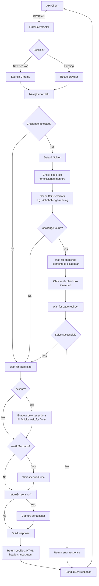

# How FlareSolverr Works

The following diagram illustrates how FlareSolverr processes requests:

## Overview

FlareSolverr is a proxy server that bypasses Cloudflare and DDoS-GUARD protection by automating a real web browser. It exposes a simple HTTP API that accepts JSON commands, performs the requested navigation in a headless Chrome instance, solves any challenges that appear, and returns the resulting cookies, HTML, and metadata.

Under the hood it uses [Selenium](https://www.selenium.dev) with the [undetected-chromedriver](https://github.com/ultrafunkamsterdam/undetected-chromedriver) to launch and control Chrome. When running in Docker, a custom stealth-patched Chromium build (amd64 only) provides additional hardening; on other architectures it falls back to stock Debian Chromium with CDP-based JavaScript patches.

## Request Lifecycle

1. **API Client sends a POST to `/v1`** with a JSON body containing the command (`request.get`, `request.post`, `sessions.create`, etc.) and its parameters.

2. **Session handling** - FlareSolverr checks whether the request references an existing session:
   - **New session**: A fresh Chrome browser instance is launched. Each session owns its own browser process, profile directory, and cookie jar. Sessions can be named explicitly or auto-assigned a UUID.
   - **Existing session**: The previously launched browser is reused, which avoids the overhead of spawning a new process and preserves cookies across requests.

3. **Navigation** - The browser navigates to the target URL with any provided custom headers or cookies.

4. **Challenge detection & resolution** - After the page begins loading, FlareSolverr determines whether a protection challenge is active:
   - It checks the page title for known challenge markers (e.g., "Just a moment...").
   - It queries the DOM for CSS selectors commonly used by Cloudflare and DDoS-GUARD challenge pages.
   - If no challenge is detected, the flow proceeds directly to waiting for the page to finish loading.
   - If a challenge is found, the **default solver** takes over:
     - Waits for challenge elements to disappear from the DOM (indicating the challenge script has finished executing).
     - Automatically clicks verification checkboxes or turnstile widgets when they appear.
     - Waits for the redirect that follows a successful solve.
     - If the challenge cannot be solved within `maxTimeout`, an error response is returned.

5. **Browser actions** - After the page is stable, the optional `actions` list is executed sequentially. Supported actions include filling form fields, clicking elements, waiting for selectors, evaluating arbitrary JavaScript, and sleeping for a fixed duration.

6. **Post-navigation wait** - If `waitInSeconds` is specified, FlareSolverr pauses for the given time before capturing results. This is useful when pages perform additional AJAX loading after the initial load event.

7. **Screenshot (optional)** - When `returnScreenshot` is enabled, a Base64-encoded PNG of the current viewport is captured.

8. **Response building** - FlareSolverr gathers:
   - Current URL and HTTP status
   - Full page HTML
   - Response headers
   - Cookies (with all attributes: domain, path, expires, httpOnly, secure, sameSite)
   - Current user agent string
   - Turnstile token, if present
   - Result of any `eval` actions

   These are packaged into a JSON response with `status: "ok"` (or an error message) and timing metadata.

## Session Management

Sessions persist in memory until they are explicitly destroyed with `sessions.destroy` or automatically cleaned up by the configured idle-timeout / max-runtime limits. Because sessions hold an entire browser process, it is important to close them when no longer needed to free RAM.

When running multiple FlareSolverr instances behind a load balancer, session affinity (sticky sessions) must be ensured so that requests for the same session ID always reach the backend that owns the browser process. This can be achieved with the `X-FlareSolverr-Session` header and HAProxy.

## Stealth & Anti-Detection

FlareSolverr offers configurable stealth modes (`off`, `standard`, `csp-safe`) via the `STEALTH_MODE` environment variable or per-session overrides. Stealth patches include:

- Removing `navigator.webdriver` and other automation flags.
- Patching Chrome DevTools Protocol leaks.
- Injecting runtime JavaScript to mask headless signatures.
- On amd64, a custom Chromium binary with C++ patches for deeper hardening.

## Pluggable Captcha Solvers

The challenge resolution layer is pluggable. The built-in `default` solver handles Cloudflare and DDoS-GUARD automatically, but custom solvers can be registered by subclassing `CaptchaSolver` and registering them with `SOLVER_MANAGER.register_solver()`. The active solver is selected via the `CAPTCHA_SOLVER` environment variable.
