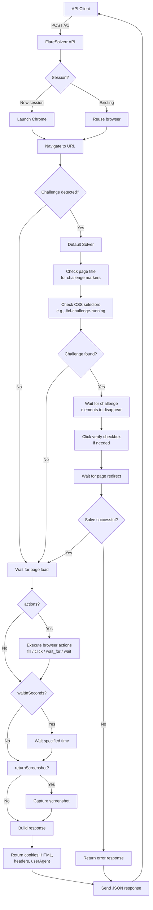

# FlareSolverr

[](https://github.com/smeinecke/FlareSolverr/releases)
[](https://github.com/smeinecke/FlareSolverr/issues)
[](https://github.com/smeinecke/FlareSolverr/pulls)
[](https://github.com/smeinecke/FlareSolverr)

> **Note:** This is a fork of the original [FlareSolverr/FlareSolverr](https://github.com/FlareSolverr/FlareSolverr) repository with additional features and fixes.

FlareSolverr is a proxy server to bypass Cloudflare and DDoS-GUARD protection.

## How it works

FlareSolverr starts a proxy server, and it waits for user requests in an idle state using few resources.
When some request arrives, it uses [Selenium](https://www.selenium.dev) with the
[undetected-chromedriver](https://github.com/ultrafunkamsterdam/undetected-chromedriver)
to create a web browser (Chrome). It opens the URL with user parameters and waits until the Cloudflare challenge
is solved (or timeout). The HTML code and the cookies are sent back to the user, and those cookies can be used to
bypass Cloudflare using other HTTP clients.

**NOTE**: Web browsers consume a lot of memory. If you are running FlareSolverr on a machine with few RAM, do not make
many requests at once and/or limit the parallel sessions with the `MAX_SESSIONS` environment variable. With each request a new browser is launched.

It is also possible to use a permanent session. However, if you use sessions, you should make sure to close them as
soon as you are done using them.

## Installation

### Docker

It is recommended to install using a Docker container because the project depends on an external browser that is
already included within the image.

Docker images are available in:

- GitHub Container Registry => `ghcr.io/smeinecke/flaresolverr:latest`
- GitHub Packages => <https://github.com/smeinecke/FlareSolverr/pkgs/container/flaresolverr>

Supported architectures are:

| Architecture | Tag          | Notes                                           |
| ------------ | ------------ | ----------------------------------------------- |
| x86          | linux/386    | Uses stock Debian Chromium (no stealth patches) |
| x86-64       | linux/amd64  | Includes custom stealth Chromium                |
| ARM32        | linux/arm/v7 | Uses stock Debian Chromium (no stealth patches) |
| ARM64        | linux/arm64  | Uses stock Debian Chromium (no stealth patches) |

> **Note:** The custom stealth-patched Chromium build is only available for **amd64**. On other architectures FlareSolverr falls back to the stock Debian `chromium` package; stealth mode still works but with reduced hardening (CDP-based JS patches only, no C++ binary patches).

We provide a `docker-compose.yml` configuration file. Clone this repository and execute
`docker-compose up -d` _(Compose V1)_ or `docker compose up -d` _(Compose V2)_ to start
the container.

If you prefer the `docker cli` execute the following command:

**Bash**

```bash
docker run -d \
  --name=flaresolverr \
  -p 8191:8191 \
  -e LOG_LEVEL=info \
  --restart unless-stopped \
  ghcr.io/smeinecke/flaresolverr:latest
```

**Command Prompt or Powershell**

```cmd
docker run -d --name=flaresolverr -p 8191:8191 -e LOG_LEVEL=info --restart unless-stopped ghcr.io/smeinecke/flaresolverr:latest
```

If your host OS is Debian, make sure `libseccomp2` version is 2.5.x. You can check the version with `sudo apt-cache policy libseccomp2`
and update the package with `sudo apt install libseccomp2=2.5.1-1~bpo10+1` or `sudo apt install libseccomp2=2.5.1-1+deb11u1`.
Remember to restart the Docker daemon and the container after the update.

### Podman

If you prefer Podman, see [PODMAN.md](./PODMAN.md) for two ready-to-run examples:

- a standard Podman deployment
- a restricted deployment with separate networks and a `dnsdist` DNS sidecar so FlareSolverr itself has no public egress

### HAProxy / Clustering

If you want to run multiple FlareSolverr instances behind a load balancer with session-aware routing, see [HAPROXY.md](./HAPROXY.md). It covers how to use the `X-FlareSolverr-Session` header with HAProxy to ensure requests for the same session always reach the backend that owns it.

### Precompiled binaries

> **Warning**
> Precompiled binaries are only available for x64 architecture. For other architectures see Docker images.

This is the recommended way for Windows users.

- Download the [FlareSolverr executable](https://github.com/smeinecke/FlareSolverr/releases) from the release's page. It is available for Windows x64 and Linux x64.
- Execute FlareSolverr binary. In the environment variables section you can find how to change the configuration.

### From source code

> **Warning**
> Installing from source code only works for x64 architecture. For other architectures see Docker images.

- Install [Python 3.13](https://www.python.org/downloads/).
- Install [Chrome](https://www.google.com/intl/en_us/chrome/) (all OS) or [Chromium](https://www.chromium.org/getting-involved/download-chromium/) (just Linux, it doesn't work in Windows) web browser.
- (Only in Linux) Install [Xvfb](https://en.wikipedia.org/wiki/Xvfb) package.
- (Only in macOS) Install [XQuartz](https://www.xquartz.org/) package.
- Install [uv](https://github.com/astral-sh/uv) (a fast Python package installer).
- Clone this repository and open a shell in that path.
- Run `uv sync` command to install FlareSolverr dependencies.
- Run `uv run python src/flaresolverr.py` command to start FlareSolverr.

### From source code (FreeBSD/TrueNAS CORE)

- Run `pkg install chromium python313 py313-pip xorg-vfbserver` command to install the required dependencies.
- Install [uv](https://github.com/astral-sh/uv) (a fast Python package installer).
- Clone this repository and open a shell in that path.
- Run `uv sync` command to install FlareSolverr dependencies.
- Run `uv run python src/flaresolverr.py` command to start FlareSolverr.

### Systemd service

We provide an example Systemd unit file `flaresolverr.service` as reference. You have to modify the file to suit your needs: paths, user and environment variables.

## Usage

Example Bash request:

```bash
curl -L -X POST 'http://localhost:8191/v1' \
-H 'Content-Type: application/json' \
--data-raw '{
  "cmd": "request.get",
  "url": "http://www.google.com/",
  "maxTimeout": 60000
}'
```

Example Python request:

```py
import requests

url = "http://localhost:8191/v1"
headers = {"Content-Type": "application/json"}
data = {
    "cmd": "request.get",
    "url": "http://www.google.com/",
    "maxTimeout": 60000
}
response = requests.post(url, headers=headers, json=data)
print(response.text)
```

Example PowerShell request:

```ps1
$body = @{
    cmd = "request.get"
    url = "http://www.google.com/"
    maxTimeout = 60000
} | ConvertTo-Json

irm -UseBasicParsing 'http://localhost:8191/v1' -Headers @{"Content-Type"="application/json"} -Method Post -Body $body
```

For the complete API reference - all commands, parameters, browser actions, JavaScript injection, and response format - see [API.md](./API.md).

## Request Flow

The following diagram illustrates how FlareSolverr processes requests:



The **default solver** handles Cloudflare challenges through browser automation:

- Detects challenges by checking page titles ("Just a moment...") and CSS selectors
- Waits for challenge elements to disappear from the DOM
- Automatically clicks the verify checkbox when presented
- Waits for page redirect after successful verification

## Environment variables

| Name               | Default                | Notes                                                                                                                                    |
| ------------------ | ---------------------- | ---------------------------------------------------------------------------------------------------------------------------------------- |
| LOG_LEVEL          | info                   | Verbosity of the logging. Use `LOG_LEVEL=debug` for more information.                                                                    |
| LOG_FILE           | none                   | Path to capture log to file. Example: `/config/flaresolverr.log`.                                                                         |
| LOG_HTML           | false                  | Only for debugging. If `true` all HTML that passes through the proxy will be logged to the console in `debug` level.                     |
| PROXY_URL          | none                   | URL for proxy. Will be overwritten by `request` or `sessions` proxy, if used. Example: `http://127.0.0.1:8080`.                          |
| PROXY_USERNAME     | none                   | Username for proxy. Will be overwritten by `request` or `sessions` proxy, if used. Example: `testuser`.                                  |
| PROXY_PASSWORD     | none                   | Password for proxy. Will be overwritten by `request` or `sessions` proxy, if used. Example: `testpass`.                                  |
| CAPTCHA_SOLVER     | default                | Captcha solving method. It is used when a captcha is encountered. See the Captcha Solvers section.                                       |
| TZ                 | UTC                    | Timezone used in the logs and the web browser. Example: `TZ=Europe/London`.                                                              |
| LANG               | none                   | Language used in the web browser. Example: `LANG=en_GB`.                                                                                 |
| ACCEPT_LANGUAGE    | en-US,en               | Default `Accept-Language` header sent by the browser. Can be overridden per-request or per-session via the `acceptLanguage` parameter. Example: `ACCEPT_LANGUAGE=de-DE,de`. |
| HEADLESS           | true                   | Only for debugging. To run the web browser in headless mode or visible.                                                                  |
| DISABLE_MEDIA      | false                  | To disable loading images, CSS, and other media in the web browser to save network bandwidth.                                            |
| JS_INJECTION_ENABLED | false                | Master switch for the `scriptInject` request parameter. Must be explicitly set to `true` to allow declarative JavaScript injection at page lifecycle points. Disabled by default for security. |
| DISABLE_QUIC       | true                   | Disables QUIC/HTTP3 in Chrome (`--disable-quic --disable-http3`) to avoid challenge transport instability on some networks/environments. |
| MINIMAL_FINGERPRINT | true                  | If `true`, avoids extra anti-detection Chrome flags (`--disable-blink-features=AutomationControlled` and site-isolation-disabling flags) to keep browser behavior closer to stock Chrome. |
| STEALTH_MODE       | off                    | Global stealth mode. Supported values: `off`, `standard`, `csp-safe` (also accepts legacy `true/false`). `standard` does **not** enable blob-worker bypass by default. Custom C++-patched Chromium hardening is only available on **amd64**; other architectures use CDP-based JS patches only. |
| UC_HEADLESS_AUTO_UA_OVERRIDE | false      | Controls undetected_chromedriver automatic headless UA override. Default `false` means no automatic UA replacement. |
| PORT               | 8191                   | Listening port. You don't need to change this if you are running on Docker.                                                              |
| HOST               | 0.0.0.0                | Listening interface. You don't need to change this if you are running on Docker.                                                         |
| PROMETHEUS_ENABLED | false                  | Enable Prometheus exporter. See the Prometheus section below.                                                                            |
| PROMETHEUS_PORT    | 8192                   | Listening port for Prometheus exporter. See the Prometheus section below.                                                                |
| SESSION_MAX_RUNTIME | none                  | Maximum lifetime of a session in seconds. When set, sessions older than this are automatically destroyed. Overrides per-session `sessionMaxRuntime`. |
| SESSION_IDLE_TIMEOUT | 900                 | Maximum idle time of a session in seconds (default: 15 minutes). Sessions idle longer than this are automatically destroyed. Overrides per-session `sessionIdleTimeout`. Always active. |
| SESSION_MAX_COUNT    | none                  | Maximum number of concurrent sessions. When exceeded, oldest idle sessions are destroyed first. |
| MAX_PARALLEL_REQUESTS | none                  | Maximum number of parallel requests processed at the same time. When exceeded, new requests receive HTTP 429 so clients can retry later. |
| XVFB_WIDTH         | 1920                   | Width of the Xvfb virtual display in pixels. Only used in headless mode on Linux.                                                       |
| XVFB_HEIGHT        | 1080                   | Height of the Xvfb virtual display in pixels. Only used in headless mode on Linux.                                                       |
| XVFB_COLORDEPTH    | 24                     | Color depth (bits per pixel) of the Xvfb virtual display. Common values: 8, 16, 24, 32. Only used in headless mode on Linux.          |

Environment variables are set differently depending on the operating system. Some examples:

- Docker: Take a look at the Docker section in this document. Environment variables can be set in the `docker-compose.yml` file or in the Docker CLI command.
- Linux: Run `export LOG_LEVEL=debug` and then run `flaresolverr` in the same shell.
- Windows: Open `cmd.exe`, run `set LOG_LEVEL=debug` and then run `flaresolverr.exe` in the same shell.

## Prometheus exporter

The Prometheus exporter for FlareSolverr is disabled by default. It can be enabled with the environment variable `PROMETHEUS_ENABLED`. If you are using Docker make sure you expose the `PROMETHEUS_PORT`.

Example metrics:

```shell
# HELP flaresolverr_request_total Total requests with result
# TYPE flaresolverr_request_total counter
flaresolverr_request_total{domain="nowsecure.nl",result="solved"} 1.0
# HELP flaresolverr_request_created Total requests with result
# TYPE flaresolverr_request_created gauge
flaresolverr_request_created{domain="nowsecure.nl",result="solved"} 1.690141657157109e+09
# HELP flaresolverr_request_duration Request duration in seconds
# TYPE flaresolverr_request_duration histogram
flaresolverr_request_duration_bucket{domain="nowsecure.nl",le="0.0"} 0.0
flaresolverr_request_duration_bucket{domain="nowsecure.nl",le="10.0"} 1.0
flaresolverr_request_duration_bucket{domain="nowsecure.nl",le="25.0"} 1.0
flaresolverr_request_duration_bucket{domain="nowsecure.nl",le="50.0"} 1.0
flaresolverr_request_duration_bucket{domain="nowsecure.nl",le="+Inf"} 1.0
flaresolverr_request_duration_count{domain="nowsecure.nl"} 1.0
flaresolverr_request_duration_sum{domain="nowsecure.nl"} 5.858
# HELP flaresolverr_request_duration_created Request duration in seconds
# TYPE flaresolverr_request_duration_created gauge
flaresolverr_request_duration_created{domain="nowsecure.nl"} 1.6901416571570296e+09
```

## Captcha Solvers

FlareSolverr includes a pluggable captcha solver interface. The built-in `default` solver handles Cloudflare challenges automatically.

The `CAPTCHA_SOLVER` environment variable selects the active solver (default: `"default"`). Custom solvers can be added by subclassing `CaptchaSolver` and registering them with `SOLVER_MANAGER.register_solver()`.

For details on the solver API, see [CAPTCHA_SOLVERS.md](./CAPTCHA_SOLVERS.md).

## Python Client Library

FlareSolverr includes a Python client library for easy integration. It is installed automatically with the package.

```python
from flaresolverr.client import FlareSolverrClient, ActionQueue

client = FlareSolverrClient("http://localhost:8191")

# Simple GET request
response = client.request.get("https://example.com")
print(response.solution.response)

# With browser actions (form filling, clicking, etc.)
actions = (
    ActionQueue()
    .fill("//input[@id='email']", "user@example.com")
    .fill("//input[@id='password']", "secret")
    .click("//button[@type='submit']")
    .build()
)
response = client.request.get("https://example.com/login", actions=actions)
```

For detailed documentation, see [src/flaresolverr/client/README.md](./src/flaresolverr/client/README.md).

## Clustering with HAProxy

FlareSolverr sessions are stored in local memory, so when running multiple instances behind a load balancer you must ensure session affinity (sticky sessions). FlareSolverr accepts the session ID via the `X-FlareSolverr-Session` HTTP header in addition to the JSON body. This allows HAProxy (or any reverse proxy) to inspect incoming traffic and route requests to the correct backend without parsing the request body.

Quick example with HAProxy:

```haproxy
backend flaresolverr_backend
    balance hdr(X-FlareSolverr-Session)
    hash-type consistent
    option httpchk GET /health
    server fs1 10.0.0.11:8191 check
    server fs2 10.0.0.12:8191 check
    server fs3 10.0.0.13:8191 check
```

For a full configuration including Docker Compose, client integration notes, and operational considerations, see [HAPROXY.md](./HAPROXY.md).

## Related projects

- C# implementation => <https://github.com/FlareSolverr/FlareSolverrSharp>
